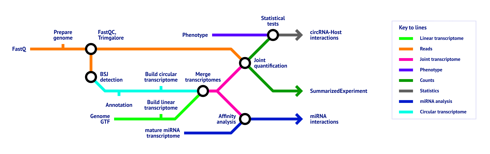

<h1>
  <picture>
    <source media="(prefers-color-scheme: dark)" srcset="docs/images/nf-core-circrna_logo_dark.png">
    
  </picture>
</h1>

[](https://github.com/nf-core/circrna/actions/workflows/ci.yml)
[](https://github.com/nf-core/circrna/actions/workflows/linting.yml)[](https://nf-co.re/circrna/results)[](https://doi.org/10.5281/zenodo.XXXXXXX)
[](https://www.nf-test.com)

[](https://github.com/nf-core/circrna/actions?query=workflow%3A%22nf-core+CI%22)
[](https://github.com/nf-core/circrna/actions?query=workflow%3A%22nf-core+linting%22)[](https://nf-co.re/circrna/results)[](https://doi.org/10.5281/zenodo.XXXXXXX)

[](https://www.nextflow.io/)
[](https://docs.conda.io/en/latest/)
[](https://www.docker.com/)
[](https://sylabs.io/docs/)
[](https://cloud.seqera.io/launch?pipeline=https://github.com/nf-core/circrna)

[](https://nfcore.slack.com/channels/circrna)[](https://twitter.com/nf_core)[](https://mstdn.science/@nf_core)[](https://www.youtube.com/c/nf-core)

## Introduction

**nf-core/circrna** is a bioinformatics pipeline to analyse total RNA sequencing data obtained from organisms with a reference genome and annotation. It takes a samplesheet and FASTQ files as input, performs quality control (QC), trimming, back-splice junction (BSJ) detection, annotation, quantification and miRNA target prediction of circular RNAs.

The pipeline is still under development, but the BSJ detection and quantification steps are already implemented and functional. The following features are planned to be implemented soon:

- Isoform-level circRNA detection and quantification
- circRNA-miRNA interaction analysis using [SPONGE](https://doi.org/10.1093/bioinformatics/btz314) and [spongEffects](https://doi.org/10.1093/bioinformatics/btad276)
- Improved downstream analyses

If you want to contribute, feel free to create an issue or pull request on the [GitHub repository](https://github.com/nf-core/circrna) or join the [Slack channel](https://nf-co.re/join/slack).

## Pipeline summary



- Raw read QC ([`FastQC`](https://www.bioinformatics.babraham.ac.uk/projects/fastqc/))
- Adapter trimming ([`Trim Galore!`](https://www.bioinformatics.babraham.ac.uk/projects/trim_galore/))
- BSJ detection
  - [`CIRIquant`](https://github.com/Kevinzjy/CIRIquant)
  - [`STAR 2-Pass mode`](https://github.com/alexdobin/STAR)
    - [`CIRCexplorer2`](https://circexplorer2.readthedocs.io/en/latest/)
    - [`circRNA finder`](https://github.com/orzechoj/circRNA_finder)
    - [`DCC`](https://github.com/dieterich-lab/DCC)
  - [`find circ`](https://github.com/marvin-jens/find_circ)
  - [`MapSplice`](http://www.netlab.uky.edu/p/bioinfo/MapSplice2)
  - [`Segemehl`](https://www.bioinf.uni-leipzig.de/Software/segemehl/)
- circRNA annotation
  - Based on a GTF file
  - Based on database files (if provided)
- Extract circRNA sequences and build circular transcriptome
- Merge circular transcriptome with linear transcriptome derived from provided GTF
- Quantification of combined circular and linear transcriptome
  - [`psirc-quant`](https://github.com/Christina-hshi/psirc)
- miRNA binding affinity analysis (only if the `mature` parameter is provided)
  - Normalizes miRNA expression (only if the `mirna_expression` parameter is provided)
  - Binding site prediction
    - [`miRanda`](http://cbio.mskcc.org/miRNA2003/miranda.html)
    - [`TargetScan`](http://www.targetscan.org/cgi-bin/targetscan/data_download.vert72.cgi)
  - Perform majority vote on binding sites
  - Compute correlations between miRNA and transcript expression levels (only if the `mirna_expression` parameter is provided)
- Statistical tests (only if the `phenotype` parameter is provided)
  - [`CircTest`](https://github.com/dieterich-lab/CircTest)
- MultiQC report [`MultiQC`](http://multiqc.info/)

## Usage

> [!NOTE]
> If you are new to Nextflow and nf-core, please refer to [this page](https://nf-co.re/docs/usage/installation) on how to set-up Nextflow. Make sure to [test your setup](https://nf-co.re/docs/usage/introduction#how-to-run-a-pipeline) with `-profile test` before running the workflow on actual data.

First, prepare a samplesheet with your input data that looks as follows:

```csv title="samplesheet.csv"
sample,fastq_1,fastq_2
CONTROL,CONTROL_R1.fastq.gz,CONTROL_R2.fastq.gz
TREATMENT,TREATMENT_R1.fastq.gz,TREATMENT_R2.fastq.gz
```

Each row represents a fastq file (single-end) or a pair of fastq files (paired end).

Now, you can run the pipeline using:

```bash
nextflow run nf-core/circrna \
   -profile <docker/singularity/.../institute> \
   --input samplesheet.csv \
   --outdir <OUTDIR>
```

> [!WARNING]
> Please provide pipeline parameters via the CLI or Nextflow `-params-file` option. Custom config files including those provided by the `-c` Nextflow option can be used to provide any configuration _**except for parameters**_;
> see [docs](https://nf-co.re/usage/configuration#custom-configuration-files).

For more details and further functionality, please refer to the [usage documentation](https://nf-co.re/circrna/usage) and the [parameter documentation](https://nf-co.re/circrna/parameters).

## Pipeline output

To see the results of an example test run with a full size dataset refer to the [results](https://nf-co.re/circrna/results) tab on the nf-core website pipeline page.
For more details about the output files and reports, please refer to the
[output documentation](https://nf-co.re/circrna/output).

```bash
nextflow run nf-core/circrna \
   -profile <docker/singularity/.../institute> \
   --input samplesheet.csv \
   --outdir <OUTDIR>
```

> [!WARNING]
> Please provide pipeline parameters via the CLI or Nextflow `-params-file` option. Custom config files including those provided by the `-c` Nextflow option can be used to provide any configuration _**except for parameters**_;
> see [docs](https://nf-co.re/usage/configuration#custom-configuration-files).

For more details and further functionality, please refer to the [usage documentation](https://nf-co.re/circrna/usage) and the [parameter documentation](https://nf-co.re/circrna/parameters).

## Pipeline output

To see the results of an example test run with a full size dataset refer to the [results](https://nf-co.re/circrna/results) tab on the nf-core website pipeline page.
For more details about the output files and reports, please refer to the
[output documentation](https://nf-co.re/circrna/output).

## Credits

nf-core/circrna was originally written by [Barry Digby](https://github.com/BarryDigby).
It was later refactored, extended and improved by [Nico Trummer](https://github.com/nictru).

We thank the following people for their extensive assistance in the development of this pipeline (in alphabetical order):

- [Alexander Peltzer](https://github.com/apeltzer)
- [Ben Whittle](https://github.com/bj-w)
- [Kevin Menden](https://github.com/KevinMenden)
- [Malte Weyrich](https://github.com/mweyrich28)
- [Marieke Vromman](https://github.com/MariekeVromman)
- [Maxime Garcia](https://github.com/maxulysse)
- [Phil Ewels](https://github.com/ewels)

## Acknowledgements


## Contributions and Support

If you would like to contribute to this pipeline, please see the [contributing guidelines](.github/CONTRIBUTING.md).

For further information or help, don't hesitate to get in touch on the [Slack `#circrna` channel](https://nfcore.slack.com/channels/circrna) (you can join with [this invite](https://nf-co.re/join/slack)).

## Citations

<!-- TODO nf-core: Add citation for pipeline after first release. Uncomment lines below and update Zenodo doi and badge at the top of this file. -->
<!-- If you use nf-core/circrna for your analysis, please cite it using the following doi: [10.5281/zenodo.XXXXXX](https://doi.org/10.5281/zenodo.XXXXXX) -->

> **nf-core/circrna: a portable workflow for the quantification, miRNA target prediction and differential expression analysis of circular RNAs.**
>
> Barry Digby, Stephen P. Finn, & Pilib Ó Broin
>
> [BMC Bioinformatics 24, 27 (2023)](https://bmcbioinformatics.biomedcentral.com/articles/10.1186/s12859-022-05125-8)
> doi: [10.1186/s12859-022-05125-8](https://doi.org/10.1186/s12859-022-05125-8)

An extensive list of references for the tools used by the pipeline can be found in the [`CITATIONS.md`](CITATIONS.md) file.

You can cite the `nf-core` publication as follows:

> **The nf-core framework for community-curated bioinformatics pipelines.**
>
> Philip Ewels, Alexander Peltzer, Sven Fillinger, Harshil Patel, Johannes Alneberg, Andreas Wilm, Maxime Ulysse Garcia, Paolo Di Tommaso & Sven Nahnsen.
>
> _Nat Biotechnol._ 2020 Feb 13. doi: [10.1038/s41587-020-0439-x](https://dx.doi.org/10.1038/s41587-020-0439-x).
