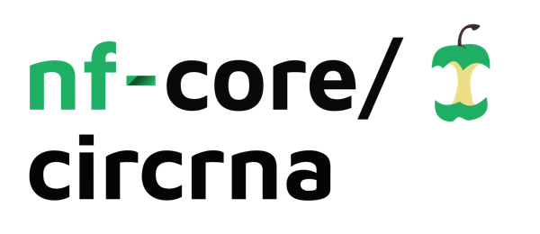

<h1>
  <picture>
    <source media="(prefers-color-scheme: dark)" srcset="docs/images/nf-core-circrna_logo_dark.png">
    
  </picture>
</h1>
[](https://github.com/nf-core/circrna/actions?query=workflow%3A%22nf-core+CI%22)
[](https://github.com/nf-core/circrna/actions?query=workflow%3A%22nf-core+linting%22)[](https://nf-co.re/circrna/results)[](https://doi.org/10.5281/zenodo.XXXXXXX)

[](https://github.com/nf-core/circrna/actions?query=workflow%3A%22nf-core+CI%22)
[](https://github.com/nf-core/circrna/actions?query=workflow%3A%22nf-core+linting%22)[](https://nf-co.re/circrna/results)[](https://doi.org/10.5281/zenodo.XXXXXXX)

[](https://www.nextflow.io/)
[](https://docs.conda.io/en/latest/)
[](https://www.docker.com/)
[](https://sylabs.io/docs/)
[](https://tower.nf/launch?pipeline=https://github.com/nf-core/circrna)

[](https://nfcore.slack.com/channels/circrna)[](https://twitter.com/nf_core)[](https://mstdn.science/@nf_core)[](https://www.youtube.com/c/nf-core)

## Introduction

**nf-core/circrna** is a bioinformatics best-practice analysis pipeline for Quantification, miRNA target prediction and differential expression analysis of circular RNAs.

The pipeline is built using [Nextflow](https://www.nextflow.io), a workflow tool to run tasks across multiple compute infrastructures in a very portable manner. It uses Docker/Singularity containers making installation trivial and results highly reproducible. The [Nextflow DSL2](https://www.nextflow.io/docs/latest/dsl2.html) implementation of this pipeline uses one container per process which makes it much easier to maintain and update software dependencies. Where possible, these processes have been submitted to and installed from [nf-core/modules](https://github.com/nf-core/modules) in order to make them available to all nf-core pipelines, and to everyone within the Nextflow community!

On release, automated continuous integration tests run the pipeline on a full-sized dataset on the AWS cloud infrastructure. This ensures that the pipeline runs on AWS, has sensible resource allocation defaults set to run on real-world datasets, and permits the persistent storage of results to benchmark between pipeline releases and other analysis sources.The results obtained from the full-sized test can be viewed on the [nf-core website](https://nf-co.re/circrna/results).

## Pipeline summary

- Raw read QC ([`FastQC`](https://www.bioinformatics.babraham.ac.uk/projects/fastqc/))
- Adapter trimming ([`Trim Galore!`](https://www.bioinformatics.babraham.ac.uk/projects/trim_galore/))
- MultiQC report [`MultiQC`](http://multiqc.info/)
- circRNA quantification
- [`CIRIquant`](https://github.com/Kevinzjy/CIRIquant)
- [`STAR 2-Pass mode`](https://github.com/alexdobin/STAR)
  - [`CIRCexplorer2`](https://circexplorer2.readthedocs.io/en/latest/)
  - [`circRNA finder`](https://github.com/orzechoj/circRNA_finder)
  - [`DCC`](https://github.com/dieterich-lab/DCC)
- [`find circ`](https://github.com/marvin-jens/find_circ)
- [`MapSplice`](http://www.netlab.uky.edu/p/bioinfo/MapSplice2)
- [`Segemehl`](https://www.bioinf.uni-leipzig.de/Software/segemehl/)
- circRNA annotation
- Export mature spliced length as FASTA file
- Annotate parent gene, underlying transcripts.
- circRNA count matrix
- miRNA target prediction
  - [`miRanda`](http://cbio.mskcc.org/miRNA2003/miranda.html)
  - [`TargetScan`](http://www.targetscan.org/cgi-bin/targetscan/data_download.vert72.cgi)
  - Filter results, miRNAs must be called by both tools
- Differential expression analysis [`DESeq2`](https://bioconductor.org/packages/release/bioc/html/DESeq2.html)
- Circular - Linear ratio tests ['CircTest'](https://github.com/dieterich-lab/CircTest)

<!-- TODO nf-core: Include a figure that guides the user through the major workflow steps. Many nf-core
     workflows use the "tube map" design for that. See https://nf-co.re/docs/contributing/design_guidelines#examples for examples.   -->

## Usage

> [!NOTE]
> If you are new to Nextflow and nf-core, please refer to [this page](https://nf-co.re/docs/usage/installation) on how to set-up Nextflow. Make sure to [test your setup](https://nf-co.re/docs/usage/introduction#how-to-run-a-pipeline) with `-profile test` before running the workflow on actual data.

<!-- TODO nf-core: Describe the minimum required steps to execute the pipeline, e.g. how to prepare samplesheets.
     Explain what rows and columns represent. For instance (please edit as appropriate):

First, prepare a samplesheet with your input data that looks as follows:

`samplesheet.csv`:

```csv
sample,fastq_1,fastq_2
CONTROL_REP1,AEG588A1_S1_L002_R1_001.fastq.gz,AEG588A1_S1_L002_R2_001.fastq.gz
```

Each row represents a fastq file (single-end) or a pair of fastq files (paired end).

-->

Now, you can run the pipeline using:

```bash
nextflow run nf-core/circrna \
    --input samplesheet.csv \
    --outdir <OUTDIR> \
    --genome GRCh37 \
    -profile <docker/singularity/podman/shifter/charliecloud/conda/institute> \
    --tool 'ciriquant' \
    --module 'circrna_discovery,mirna_prediction,differential_expression' \
    --bsj_reads 2
```

```bash
nextflow run nf-core/circrna \
   -profile <docker/singularity/.../institute> \
   --input samplesheet.csv \
   --outdir <OUTDIR>
```

> [!WARNING]
> Please provide pipeline parameters via the CLI or Nextflow `-params-file` option. Custom config files including those provided by the `-c` Nextflow option can be used to provide any configuration _**except for parameters**_;
> see [docs](https://nf-co.re/usage/configuration#custom-configuration-files).

For more details and further functionality, please refer to the [usage documentation](https://nf-co.re/circrna/usage) and the [parameter documentation](https://nf-co.re/circrna/parameters).

## Pipeline output

To see the results of an example test run with a full size dataset refer to the [results](https://nf-co.re/circrna/results) tab on the nf-core website pipeline page.
For more details about the output files and reports, please refer to the
[output documentation](https://nf-co.re/circrna/output).

```bash
nextflow run nf-core/circrna \
   -profile <docker/singularity/.../institute> \
   --input samplesheet.csv \
   --outdir <OUTDIR>
```

> [!WARNING]
> Please provide pipeline parameters via the CLI or Nextflow `-params-file` option. Custom config files including those provided by the `-c` Nextflow option can be used to provide any configuration _**except for parameters**_;
> see [docs](https://nf-co.re/usage/configuration#custom-configuration-files).

For more details and further functionality, please refer to the [usage documentation](https://nf-co.re/circrna/usage) and the [parameter documentation](https://nf-co.re/circrna/parameters).

## Pipeline output

To see the results of an example test run with a full size dataset refer to the [results](https://nf-co.re/circrna/results) tab on the nf-core website pipeline page.
For more details about the output files and reports, please refer to the
[output documentation](https://nf-co.re/circrna/output).

## Credits

nf-core/circrna was originally written by Barry Digby.

We thank the following people for their extensive assistance in the development of this pipeline:

- @apeltzer
- @ewels
- @maxulysse
- @KevinMenden
- @bj-w

## Acknowledgements


## Contributions and Support

If you would like to contribute to this pipeline, please see the [contributing guidelines](.github/CONTRIBUTING.md).

For further information or help, don't hesitate to get in touch on the [Slack `#circrna` channel](https://nfcore.slack.com/channels/circrna) (you can join with [this invite](https://nf-co.re/join/slack)).

## Citations

<!-- TODO nf-core: Add citation for pipeline after first release. Uncomment lines below and update Zenodo doi and badge at the top of this file. -->
<!-- If you use nf-core/circrna for your analysis, please cite it using the following doi: [10.5281/zenodo.XXXXXX](https://doi.org/10.5281/zenodo.XXXXXX) -->

> **nf-core/circrna: a portable workflow for the quantification, miRNA target prediction and differential expression analysis of circular RNAs.**
>
> Barry Digby, Stephen P. Finn, & Pilib Ó Broin
>
> [BMC Bioinformatics 24, 27 (2023)](https://bmcbioinformatics.biomedcentral.com/articles/10.1186/s12859-022-05125-8)
> doi: [10.1186/s12859-022-05125-8](https://doi.org/10.1186/s12859-022-05125-8)

An extensive list of references for the tools used by the pipeline can be found in the [`CITATIONS.md`](CITATIONS.md) file.

You can cite the `nf-core` publication as follows:

> **The nf-core framework for community-curated bioinformatics pipelines.**
>
> Philip Ewels, Alexander Peltzer, Sven Fillinger, Harshil Patel, Johannes Alneberg, Andreas Wilm, Maxime Ulysse Garcia, Paolo Di Tommaso & Sven Nahnsen.
>
> _Nat Biotechnol._ 2020 Feb 13. doi: [10.1038/s41587-020-0439-x](https://dx.doi.org/10.1038/s41587-020-0439-x).
