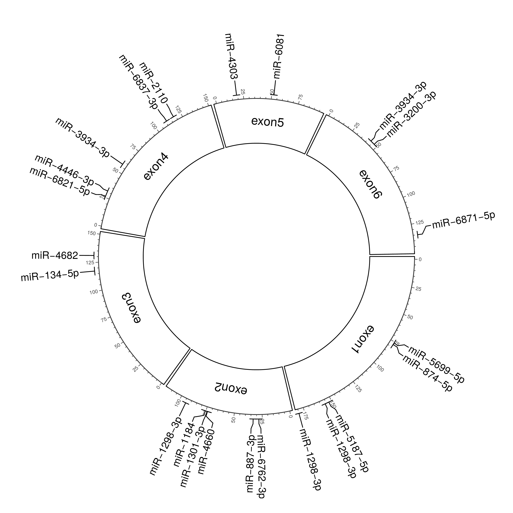

# nf-core/circrna: Output

## Introduction

This documentation describes the output of `nf-core/circrna` for the test dataset which runs all 3 modules in the workflow: `circRNA discovery` , `miRNA prediction` and `differential expression` analysis of circular RNAs in RNA-Seq data.

A full run of the workflow will produce the following directory output structure:

```console
|-- results/
        |-- circrna_discovery
        |-- differential_expression
        |-- mirna_prediction
        |-- pipeline_info
        |-- quality_control
        |-- reference_genome
```

## Pipeline Overview

The pipeline is built using [Nextflow](https://www.nextflow.io/) and processes data using the following steps:

- [nf-core/circrna: Output](#nf-corecircrna-output)
  - [Introduction](#introduction)
  - [Pipeline Overview](#pipeline-overview)
  - [Quality Control](#quality-control)
    - [Sam to Fastq](#sam-to-fastq)
    - [BBDUK](#bbduk)
    - [DESeq2](#deseq2)
    - [MultiQC](#multiqc)
  - [Genome Index Files](#genome-index-files)
  - [circRNA Quantification](#circrna-quantification)
    - [CIRCexplorer2](#circexplorer2)
    - [circRNA finder](#circrna-finder)
    - [CIRIquant](#ciriquant)
    - [DCC](#dcc)
    - [Find circ](#find-circ)
    - [MapSplice](#mapsplice)
    - [STAR](#star)
    - [Segemehl](#segemehl)
    - [Count Matrix](#count-matrix)
  - [miRNA Prediction](#mirna-prediction)
    - [miRanda](#miranda)
    - [TargetScan](#targetscan)
    - [miRNA targets](#mirna-targets)
    - [Circos Plot](#circos-plot)
  - [Differential Expression Analysis](#differential-expression-analysis)
    - [circRNA](#circrna)
    - [Boxplots](#boxplots)
    - [RNA-Seq](#rna-seq)

## Quality Control

### Sam to Fastq

<details markdown="1">
<summary>Output files</summary>

- `quality_control/SamToFastq`
  - `*_R{1,2}.fq.gz`: Paired end fastq files, generated using `VALIDATION_STRINGENCY=LENIENT`.

</details>

`nf-core/circrna` can accept input BAM files generated from paired end sequencing reads (e.g `TCGA`) by invoking [picard](https://broadinstitute.github.io/picard/) `SamToFastq`, converting BAM files to paired end fastq files.

### BBDUK

<details markdown="1">
<summary>Output files</summary>

- `quality_control/BBDUK/`
  - `*_r{1,2}.trim.fq.gz`: Processed paired end fastq files.

</details>

[BBDUK](https://jgi.doe.gov/data-and-tools/bbtools/bb-tools-user-guide/bbduk-guide/) (DUK - "Decontamination Using Kmers") is capable of performing adapter trimming, quality trimming/filtering and read length filtering (refer to BBDUK [parameter documentation](https://nf-co.re/circrna/dev/parameters#read-trimming--adapter-removal)) for the quality control of sequencing reads. `nf-core/circrna` will automatically output gzipped fastq files from `BBDUK` to minimise data usage.

### DESeq2

<details markdown="1">
<summary>Output files</summary>

- `quality_control/DESeq2_QC`

  - `circRNA/`

    - `DESeq2_condition_PCA.pdf`: PCA plot of PC1 vs. PC2 displaying the highest amount of variation within the response variable `condition`.
    <p markdown="1" align="center">
    
    </p>

    - `DESeq2_dispersion.pdf`: Plot of re-fitted genes + gene outliers after shrinkage estimation performed by gene-wide maximum likelihood estimates (red curve) & maximum a posteriori estimates of dispersion.
    <p markdown="1" align="center">
    
    </p>

    - `DESeq2_sample_dendogram.pdf`: Dendogram displaying sample distances using [pvclust](https://cran.r-project.org/web/packages/pvclust/index.html).
    <p markdown="1" align="center">
    
    </p>

    - `DESeq2_sample_heatmap.pdf`: Heatmap displaying Manhattan distance between samples.
    <p markdown="1" align="center">
    
    </p>

  - `RNA-Seq/`

    - `DESeq2_condition_PCA.pdf`: PCA plot of PC1 vs. PC2 displaying the highest amount of variation within the response variable `condition`.
    <p markdown="1" align="center">
    
    </p>

    - `DESeq2_dispersion.pdf`: Plot of re-fitted genes + gene outliers after shrinkage estimation performed by gene-wide maximum likelihood estimates (red curve) & maximum a posteriori estimates of dispersion.
    <p markdown="1" align="center">
    
    </p>

    - `DESeq2_sample_dendogram.pdf`: Dendogram displaying sample distances using [pvclust](https://cran.r-project.org/web/packages/pvclust/index.html).
    <p markdown="1" align="center">
    
    </p>

    - `DESeq2_sample_heatmap.pdf`: Heatmap displaying Manhattan distance between samples.
    <p markdown="1" align="center">
    
    </p>

</details>

`nf-core/circrna` outputs quality control plots of normalised _log2_ expression data from `DESeq2` to assess heterogeneity in the experiment samples. These plots can be useful to assess sample-sample similarity and to identify potential batch effects within the experiment. Plots are generated for both circRNAs and RNA-Seq data when the differential expression analysis module has been selected by the user (see `--module` [documentation](https://nf-co.re/circrna/dev/parameters#pipeline-options)).

### MultiQC

<details markdown="1">
<summary>Output files</summary>

- `quality_control/MultiQC/`
  - `Raw_Reads_MultiQC.html`: Summary reports of unprocessed RNA-Seq reads.
  - `Trimmed_Reads_MultiQC.html`: Summary reports of processed RNA-Seq reads.

</details>

[MultiQC](http://multiqc.info) is a visualization tool that generates a single HTML report summarising all samples in your project. `nf-core` outputs HTML reports for sequencing read quality control.

## Genome Index Files

<details markdown="1">
<summary>Output files</summary>

- `reference_genome`
  - `BowtieIndex/`: Directory containing `Bowtie` indices.
  - `Bowtie2Index/`: Directory containing `Bowtie2` indices.
  - `BWAIndex/`: Directory containing `BWA` indices.
  - `Hisat2Index/`: Directory containing `HISAT2` indices.
  - `SAMtoolsIndex`: Directory containing `SAMtools` index file.
  - `STARIndex`: Directory containing `STAR` indices.
  - `SegemehlIndex`: Directory containing `Segemehl` index file.

</details>

`nf-core/circrna` will save genome indices when `--save_reference true`. This is highly encouraged to reduce runtimes on redeployment of the workflow.

## circRNA Quantification

### CIRCexplorer2

<details markdown="1">
<summary>Output files</summary>

- `circrna_discovery/CIRCexplorer2/intermediates/${sample_id}/`

  - `*.STAR.junction.bed`: Intermediate file generated by `CIRCexplorer2 parse` module, identifying STAR fusion junctions for downstream annotation.
  - `*.txt`: Output files generated by `CIRCexplorer2 annotate` module, based on BED 12 format containing circRNA genomic location information, exon cassette composition and an additional 6 columns specifying circRNA annotations. Full descriptions of the 18 columns can be found in the `CIRCexplorer2` [documentation](https://circexplorer2.readthedocs.io/en/latest/modules/annotate/#output).

- `circrna_discovery/CIRCexplorer2/${sample_id}/`
  - `${sample_id}.bed`: Filtered, annotated circRNAs in customised BED12 format.
  - `fasta/`: Mature spliced length circRNA FASTA sequences.

</details>

[CIRCexplorer2](https://circexplorer2.readthedocs.io/en/latest/) uses `*.Chimeric.out.junction` files generated from `STAR` 2 pass mode to extract back-splice junction sites using the `CIRCexplorer2 parse` module. Following this, `CIRCexplorer2 annotate` performs re-alignment of reads to the back-splice junction sites to determine the precise positions of downstream donor and upstream acceptor splice sites. Back-splice junction sites are subsequently updated and annotated using the customised annotation text file.

### circRNA finder

<details markdown="1">
<summary>Output files</summary>

- `circrna_discovery/circRNA_Finder/intermediates/${sample_id}/`

  - `*.Aligned.sortedByCoord.out.bam`: Coordinate sorted bam file containing aligned reads and chimeric reads.
  - `*.Chimeric.out.junction`: Each line contains the details of chimerically aligned reads. Full descriptions of columns can be found in `STAR` [documentation](https://physiology.med.cornell.edu/faculty/skrabanek/lab/angsd/lecture_notes/STARmanual.pdf) (section 5.4).
  - `*.Chimeric.out.sam`: Chimeric alignments in SAM format.
  - `*.Log.final.out`: Summary mapping statistics after mapping job is complete, useful for quality control. The statistics are calculated for each read (single- or paired-end) and then summed or averaged over all reads.
  - `*.Log.out`: Main log file with a lot of detailed information about the run. This file is most useful for troubleshooting and debugging.
  - `*.Log.progress.out`: Reports job progress statistics, such as the number of processed reads, % of mapped reads etc.
  - `*.SJ.out.tab`: High confidence collapsed splice junctions in tab-delimited form. Full description of columns can be found in `STAR` [documentation](https://physiology.med.cornell.edu/faculty/skrabanek/lab/angsd/lecture_notes/STARmanual.pdf) (section 4.4).
  - `*.Chimeric.out.sorted.{bam,bam.bai}`: (Sorted and indexed) bam file with all chimeric reads identified by STAR. The circRNA junction spanning reads are a subset of these.
  - `*.filteredJunctions.bed`: A bed file with **all** circular junctions found by the pipeline. The score column indicates the number reads spanning each junction.
  - `*.s_filteredJunctions.bed`: A bed file with those junctions in `*.filteredJunctions.bed` that are flanked by GT-AG splice sites. The score column indicates the number reads spanning each junction.
  - `*.s_filteredJunctions_fw.bed`: A bed file with the same circular junctions as in file (b), but here the score column gives the average number of forward spliced reads at both splice sites around each circular junction.

- `circrna_discovery/circRNA_Finder/${sample_id}/
  - `${sample_id}.bed`: Filtered, annotated circRNAs in customised BED12 format.
  - `fasta/`: Mature spliced length circRNA FASTA sequences.

</details>

[circRNA finder](https://github.com/orzechoj/circRNA_finder) uses `*.Chimeric.out.sam`, `*.Chimeric.out.junction` & `*.SJ.out.tab` files to identify circular RNAs in RNA-Seq data.

### CIRIquant

<details markdown="1">
<summary>Output files</summary>

- `circrna_discovery/CIRIquant/intermediates/${sample_id}/`

  - `*.log`: A `CIRIerror.log` file which should be empty, and a `${sample_id}.log` file which contains the output log of `CIRIquant`.
  - `*.bed`: `CIRI2` output file in BED 6 format.
  - `*.gtf`: Output file from `CIRIquant` in GTF format. Full description of the columns available in the `CIRIquant` [documentation](https://ciriquant-cookbook.readthedocs.io/en/latest/quantification.html#output-format).
  - `align/`
    - `*.sorted.{bam, bam.bai}`: (Sorted and indexed) bam file from `HISAT2` alignment of RNA-Seq reads.
  - `circ/`
    - `*.ciri`: `CIRI2` output file.
    - `*_denovo.sorted.{bam, bam.bai}`: (Sorted and indexed) bam file from `BWA` alignment of candidate circular reads to the pseudo reference.
    - `*_index.*.ht2`: `BWA` index files of the pseudo reference.
    - `*_index.fa`: Reference FASTA file of candidate circular reads.

- `circrna_discovery/CIRIquant/${sample_id}/``
  - `${sample_id}.bed`: Filtered, annotated circRNAs in customised BED12 format.
  - `fasta/`: Mature spliced length circRNA FASTA sequences.

</details>

[CIRIquant](https://github.com/Kevinzjy/CIRIquant) operates by aligning RNA-Seq reads using `HISAT2` and [CIRI2](https://sourceforge.net/projects/ciri/files/CIRI2/) to identify putative circRNAs. Next, a pseudo reference index is generated using `bwa index` by concatenating the two full-length sequences of the putative back-splice junction regions. Candidate circular reads are re-aligned against this pseudo reference using `bwa mem`, and back-splice junction reads are determined if they can be linearly and completely aligned to the putative back-splice junction regions.

### DCC

<details markdown="1">
<summary>Output files</summary>

- `/circrna_discovery/DCC/intermediates/${sample_id}/`

  - `*CircCoordinates`: Circular RNA annotations in BED format. Full description of the columns are available in the `DCC` [documentation](https://github.com/dieterich-lab/DCC#output-files-generated-by-dcc).
  - `*CircRNACount`: A table containing read counts for circRNAs detected.
  - `mate1/`: Output directory of STAR 2nd pass alignment for R1.
  - `mate2/`: Output directory of STAR 2nd pass alignment for R2.

- `circrna_discovery/DCC/${sample_id}/`
  - `${sample_id}.bed`: Filtered, annotated circRNAs in customised BED12 format.
  - `fasta/`: Mature spliced length circRNA FASTA sequences.

</details>

[DCC](https://github.com/dieterich-lab/DCC) identifies back-splice junction sites from `*Chimeric.out.junction`, `*SJ.out.tab` & `*Aligned.sortedByCoord.out.bam` files generated by `STAR` 2 pass mode, mapping the paired end reads both jointly and separately (`STAR` does not output read pairs that contain more than one chimeric junction thus a more granular approach is taken by `DCC` to fully characterise back-splice junctions in reads).

`DCC` then performs a series of filtering steps on candidate circular reads:

1. Mapping of mates must be consistent with a circular RNA template i.e align to the back-splice junction.
2. Filtering by a minimum number of junction reads per replicate (`nf-core/circrna` has set this parameter to`-Nr 1 1` allowing all reads).
3. Circular reads are not allowed span more than one gene.
4. Circular reads aligning to mitochondrial genome are removed.
5. Circular reads that lack a canonical (GT/AG) splicing signal at the circRNA junction borders are removed.

### Find circ

<details markdown="1">
<summary>Output files</summary>

- `circrna_discovery/find_circ/intermediates/${sample_id}/`

  - `*_anchors.qfa.gz`: 20mer anchors extracted from unmapped reads.
  - `*_unmapped.bam`: Unmapped RNA-Seq reads to reference genome.
  - `*.sites.bed`: Output from `find_circ`, first six columns are in standard BED format. A description of the remaining columns is available in the `find_circ` [documentation](https://github.com/marvin-jens/find_circ#output-format).
  - `*.sites.log`: Summary statistics of candidate circular reads in the sample.
  - `*.sites.reads`: Tab delimited file containing circRNA ID & sequence.

- `circrna_discovery/find_circ/${sample_id}/`
  - `${sample_id}.bed`: Filtered, annotated circRNAs in customised BED12 format.
  - `fasta/`: Mature spliced length circRNA FASTA sequences.

</details>

[find circ](https://github.com/marvin-jens/find_circ) utilises `Bowtie2` short read mapper to align RNA-Seq reads to the genome. Reads that align fully and contiguously are discarded. Unmapped reads are converted to 20mers and aligned independently to find unique anchor positions within spliced exons - anchors that align in reverse orientation indicate circular RNA junctions. Anchor alignments are extended and must meet the following criteria:

1. Breakpoints flanked by GT/AG splice sites.
2. Unambiguous breakpoint detection.
3. Maximum 2 mismatches in extension procedure.
4. Breakpoint cannot reside more than 2nt inside a 20mer anchor.
5. 2 reads must support the junction.

### MapSplice

<details markdown="1">
<summary>Output files</summary>

- `circrna_discovery/MapSplice/intermediates/${sample_id}/`

  - `alignments.bam`: Bam file containing aligned reads and fusion alignments.
  - `deletions.txt`: Report of deletions.
  - `Fusion output files`:
    - `fusions_raw.txt`: raw fusion junctions without filtering
    - `fusion_candidates.txt`: filtered fusion junctions
    - `fusions_well_annotated.txt`: annotated fusion junction candidates (align to annotation file provided)
    - `fusions_not_well_annotated.txt`: fusions that do not align with supplied annotations
  - `circular_RNAs.txt`: circular RNAs reported.
  - `insertions.txt`: Report of Insertions.
  - `junctions.txt`: Reported splice junctions.
  - `stats.txt`: Read alignment, Junction statistics.

- `circrna_discovery/MapSplice/${sample_id}/`
  - `${sample_id}.bed`: Filtered, annotated circRNAs in customised BED12 format.
  - `fasta/`: Mature spliced length circRNA FASTA sequences.

</details>

[MapSplice](http://www.netlab.uky.edu/p/bioinfo/MapSplice2) first splits reads into segments, and maps them to reference genome by using `Bowtie`. `MapSplice` attempts to fix unmapped segments as gapped alignments, with each gap corresponding to a splice junction. Finally a remapping step is used to identify back-spliced alignments that are in the presence of small exons.

### STAR

<details markdown="1">
<summary>Output files</summary>

- `circrna_discovery/STAR/1st_Pass/${sample_id}/`

  - `*.Aligned.sortedByCoord.out.bam`: Coordinate sorted bam file containing aligned reads and chimeric reads.
  - `*.Chimeric.out.junction`: Each line contains the details of chimerically aligned reads. Full descriptions of columns can be found in `STAR` [documentation](https://physiology.med.cornell.edu/faculty/skrabanek/lab/angsd/lecture_notes/STARmanual.pdf) (section 5.4).
  - `*.Chimeric.out.sam`: Chimeric alignments in SAM format.
  - `*.Log.final.out`: Summary mapping statistics after mapping job is complete, useful for quality control. The statistics are calculated for each read (single- or paired-end) and then summed or averaged over all reads.
  - `*.Log.out`: Main log file with a lot of detailed information about the run. This file is most useful for troubleshooting and debugging.
  - `*.Log.progress.out`: Reports job progress statistics, such as the number of processed reads, % of mapped reads etc.
  - `*.SJ.out.tab`: High confidence collapsed splice junctions in tab-delimited form. Full description of columns can be found in `STAR` [documentation](https://physiology.med.cornell.edu/faculty/skrabanek/lab/angsd/lecture_notes/STARmanual.pdf) (section 4.4).

- `circrna_discovery/STAR/2nd_Pass/${sample_id}/`

  - `*.Aligned.sortedByCoord.out.bam`: Coordinate sorted bam file containing aligned reads and chimeric reads.
  - `*.Chimeric.out.junction`: Each line contains the details of chimerically aligned reads. Full descriptions of columns can be found in `STAR` [documentation](https://physiology.med.cornell.edu/faculty/skrabanek/lab/angsd/lecture_notes/STARmanual.pdf) (section 5.4).
  - `*.Chimeric.out.sam`: Chimeric alignments in SAM format.
  - `*.Log.final.out`: Summary mapping statistics after mapping job is complete, useful for quality control. The statistics are calculated for each read (single- or paired-end) and then summed or averaged over all reads.
  - `*.Log.out`: Main log file with a lot of detailed information about the run. This file is most useful for troubleshooting and debugging.
  - `*.Log.progress.out`: Reports job progress statistics, such as the number of processed reads, % of mapped reads etc.
  - `*.SJ.out.tab`: High confidence collapsed splice junctions in tab-delimited form. Full description of columns can be found in `STAR` [documentation](https://physiology.med.cornell.edu/faculty/skrabanek/lab/angsd/lecture_notes/STARmanual.pdf) (section 4.4).

- `circrna_discovery/STAR/SJFile/`
  - `*.SJFile.tab`: Chromosome, start, end & strand coordinates of novel splice junctions.

</details>

[STAR](https://github.com/alexdobin/STAR) can characterise novel splice junctions in RNA-Seq data by specifying `--ChimOutType Junctions`, with reported novel junctions written to a `*SJ.out.tab` file (per sample). Following the initial `STAR` alignment, a 2nd pass strategy is employed whereby **all** `*SJ.out.tab` files from RNA-Seq samples are converted to `*SJFile.tab` files of novel junction coordinates and provided during the 2nd alignment step via `--sjdbFileChrStartEnd`.

This achieves the highest sensitivity for novel junction alignment. For instance, if there is a novel junction that's highly expressed (many reads, confident detection) in the wild-type, but only weakly expressed (few reads) in the experimental group, by using junctions detected in all samples for the 2nd pass, `STAR` will detect lowly expressed spliced reads in the experimental group.

### Segemehl

<details markdown="1">
<summary>Output files</summary>

- `circrna_discovery/Segemehl/intermediates/${sample_id}/`
  - `*.bam`: Aligned reads in BAM format
  - `*_collapsed.bed`: Segemehl circRNA counts in minimal BED 6 format
  - `*.mult.bed`: Thus, this bed file contains all splice events of a read. The start and end positions indicate the nucleotide after the first split (i.e. the beginning of the first intron) and the nucleotide before the last split (i.e. the end of the last intron), respectively. The name and score are equivalent to the one in the \*.sngl file described above. The following fields 7 & 8 (thickStart and thickEnd) should be the identical to fields 2 & 3. Field 9 holds the color information for the item in RGB encoding (itemRGB). Field 10 (blockCount) indicates the number of splits represented by the BED item. Field 11 is a comma separated list of the intron sizes (blockSizes). Field 12 is the comma separated list of intron starts (blockStarts).
  - `*.sngl.bed`: The bed file contains all single splice events predicted in the split read alignments.
  - `*.trns.bed`: The custom text file contains all single split alignments predicted to be in trans, i.e. split alignments that are located on different chromosomes and/or different strands.

</details>

`Segemehl` implements split read alignment mode for reads that failed the attempt of collinear alignment. The algorithm will consider circular alignments. Circular splits are output to `${sample_id}.sngl.bed` and parsed using customised scripts to produce counts representative of `Segemehl` quantification.

### Count Matrix

<details markdown="1">
<summary>Output files</summary>

- `circrna_discovery/`
  - `count_matrix.txt`: Raw circRNA read counts for all samples in matrix format.

</details>

`nf-core/circrna` produces a counts matrix of circRNA read counts for each sample. circRNAs with BSJ reads < `--bsj_reads <int>` have been removed during the quantification step, with a further filtering step included depending on the number of quantification tools selected. If the user has selected more than one circRNA quantification tool, `nf-core/circrna` will demand that a circRNA be called by at least two quantification tools or else it is removed. This approach is recommended to reduce the number of false positives.

## miRNA Prediction

### miRanda

<details markdown="1">
<summary>Output files</summary>

- `mirna_prediction/miRanda/${sample_id}/`
  - `*.miRanda.txt`: Raw outputs from `miRanda`.

</details>

[miRanda](http://cbio.mskcc.org/miRNA2003/miranda.html) performs miRNA target prediction of a genomic sequence against a miRNA database in 2 phases:

1. First a dynamic programming local alignment is carried out between the query miRNA sequence and the reference sequence. This alignment procedure scores based on sequence complementarity and not on sequence identity.
2. Secondly, the algorithm takes high-scoring alignments detected from phase 1 and estimates the thermodynamic stability of RNA duplexes based on these alignments. This second phase of the method utilises folding routines from the `RNAlib` library, part of the [ViennaRNA](https://www.tbi.univie.ac.at/RNA/) package.

### TargetScan

<details markdown="1">
<summary>Output files</summary>

- `mirna_prediction/TargetScan/${sample_id}/`
  - `*.targetscan.txt`: Raw outputs from `TargetScan`.

</details>

[TargetScan](http://www.targetscan.org/vert_72/) predicts biological targets of miRNAs by searching for the presence of conserved 8mer, 7mer, and 6mer sites within the circRNA mature sequence that match the seed region of each miRNA.

### miRNA targets

<details markdown="1">
<summary>Output files</summary>

- `mirna_prediction/${sample_id}/`
  - `*_miRNA_targets.txt`: Filtered target miRNAs of circRNAs called by quantification tools. Columns are self explanatory: miRNA, Score, Energy_KcalMol, Start, End, Site_type.

</details>

`nf-core/circrna` performs miRNA target filtering on `miRanda` and `TargetScan` predictions:

1. miRNA must be called by both `miRanda` and `TargetScan`.
2. If a site within the circRNA mature sequence shares duplicate miRNA ID's overlapping the same coordinates, the miRNA with the highest score is kept.

### Circos Plot

<details markdown="1">
<summary>Output files</summary>

- `mirna_prediction/${sample_id}/`
  - `*_miRNA_Plot.pdf`: Circos plot of mature spliced circRNA sequence with exon boundaries where applicable, displaying miRNA binding sites.
  <p markdown="1" align="center">
  
  </p>

</details>

`nf-core/circrna` plots the filtered miRNA targets given using a circos plot, displaying the miRNA response elements along the mature circRNA sequence. Please note this plot becomes overcrowded when plotting `EIciRNAs` due to their highly variable sequence length (in contrast to `circRNAs` and `ciRNAs` which typically fall within the range of 100 - 1000nt). Therefore `EIciRNAs` with large mature spliced lengths should be considered as potentially spurious calls.

## Differential Expression Analysis

`nf-core/circrna` will perform differential expression analysis by contrasting every variable within the `condition` column i.e the response variable.

| samples       | condition |
| ------------- | --------- |
| control_rep1  | control   |
| control_rep2  | control   |
| control_rep3  | control   |
| lung_rep1     | lung      |
| lung_rep2     | lung      |
| lung_rep3     | lung      |
| melanoma_rep1 | melanoma  |
| melanoma_rep2 | melanoma  |
| melanoma_rep3 | melanoma  |

The above experimental design will produce the `DESeq2` design formula `~ condition` and loop through the nested factors within `condition` producing outputs for `control_vs_lung`, `control_vs_melanoma`, `lung_vs_control`, `lung_vs_melanoma`, `melanoma_vs_control` and `melanoma_vs_lung`, capturing every possible contrast.

_N.B:_ In the phenotype file the response variable must be called `condition`, these values are hard-coded in the automated differential expression analysis R script.

### circRNA

<details markdown="1">
<summary>Output files</summary>

- `differential_expression/circRNA/`

  - `DESeq2_log2_transformed_counts.txt`: _log2(Normalised counts + 1)_

  - `DESeq2_normalized_counts.txt`: Normalised circRNA counts.

  - `control_vs_lung/`

    - `DESeq2_{control_vs_lung}_Adj_pvalue_distribution.pdf`: Histogram of Adj pvalues from `results(dds)` displaying the distribution of circRNAs that reject the null hypothesis (padj <= 0.05).
    <p markdown="1" align="center">
    
    </p>

    - `DESeq2_{control_vs_lung}_down_regulated_differential_expression.txt`: DESeq2 `results()` output filtered to include down regulated circRNAs (fold change <= -1, pvalue <= 0.05) in `condition` with respect to `control`.

    - `DESeq2_{control_vs_lung}_fold_change_distribution.pdf`: Histogram of fold-change values for differentially expressed circRNAs.
    <p markdown="1" align="center">
    
    </p>

    - `DESeq2_{control_vs_lung}_heatmap.pdf`: Heatmap of all differentially expressed circRNAs.
    <p markdown="1" align="center">
    
    </p>

    - `DESeq2_{control_vs_lung}_MA_plot.pdf`: Plot of the relationship between intensity and difference between the contrast made by `DESeq2`.
    <p markdown="1" align="center">
    
    </p>

    - `DESeq2_{control_vs_lung}_pvalue_distribution.pdf`: Histogram of pvalues from `results(dds)` displaying the distribution of circRNAs that reject the null hypothesis (pvalue <= 0.05).
    <p markdown="1" align="center">
    
    </p>

    - `DESeq2_{condition_vs_lung}_up_regulated_differential_expression.txt`: DEseq2 `results()` ouput filtered to include up regulated circRNAs (fold change >= 1, pvalue <= 0.05) in `condition` with respect to `control`.

    - `DESeq2_{condition_vs_lung}_volcano_plot.pdf`: Volcano plot of differentially expressed circRNAs from DESeq2 `results()` using [EnhancedVolcano](https://www.bioconductor.org/packages/release/bioc/vignettes/EnhancedVolcano/inst/doc/EnhancedVolcano.html).
    <p markdown="1" align="center">
    
    </p>

</details>

Sample outputs from `control_vs_lung` are given below, one of 6 `DESeq2` results folders returned by the experimental design given above.

_Note:_ The test dataset produces sparsely populated plots due to aggressive subsampling.

### Boxplots

<details markdown="1">
<summary>Output files</summary>

- `differential_expression/boxplots/`

  - `control_vs_lung`

    - `*boxplot.pdf`: Boxplot of differentially expressed circRNAs in `control_vs_lung`.
    <p markdown="1" align="center">
    
    </p>

  - `control_vs_lung`
    - `*boxplot.pdf`: Boxplot of differentially expressed circRNAs in `control_vs_melanoma`.
    <p markdown="1" align="center">
    
    </p>

</details>

`nf-core/circrna` will produce boxplots of differentially expressed circRNAs (normalised expression) between all contrasts available in `condition`.

_Note:_ The output files give examples for `control_vs_lung` and `control_vs_melanoma`.

### RNA-Seq

<details markdown="1">
<summary>Output files</summary>

- `differential_expression/RNA-Seq/`

  - `DESeq2_log2_transformed_counts.txt`: _log2(Normalised counts + 1)_

  - `DESeq2_normalized_counts.txt`: Normalised RNA-Seq counts.

  - `control_vs_lung/`

    - `DESeq2_{control_vs_lung}_Adj_pvalue_distribution.pdf`: Histogram of Adj pvalues from `results(dds)` displaying the distribution of genes that reject the null hypothesis (padj <= 0.05).
    <p markdown="1" align="center">
    
    </p>

    - `DESeq2_{control_vs_lung}_down_regulated_differential_expression.txt`: DESeq2 `results()` output filtered to include down regulated genes (fold change <= -1, pvalue <= 0.05) in `condition` with respect to `control`.

    - `DESeq2_{control_vs_lung}_fold_change_distribution.pdf`: Histogram of fold-change values for differentially expressed genes.
    <p markdown="1" align="center">
    
    </p>

    - `DESeq2_{control_vs_lung}_heatmap.pdf`: Heatmap of all differentially expressed genes.
    <p markdown="1" align="center">
    
    </p>

    - `DESeq2_{control_vs_lung}_MA_plot.pdf`: Plot of the relationship between intensity and difference between the contrast made by `DESeq2`.
    <p markdown="1" align="center">
    
    </p>

    - `DESeq2_{control_vs_lung}_pvalue_distribution.pdf`: Histogram of pvalues from `results(dds)` displaying the distribution of genes that reject the null hypothesis (pvalue <= 0.05).
    <p markdown="1" align="center">
    
    </p>

    - `DESeq2_{condition_vs_lung}_up_regulated_differential_expression.txt`: DEseq2 `results()` ouput filtered to include up regulated genes (fold change >= 1, pvalue <= 0.05) in `condition` with respect to `control`.

    - `DESeq2_{condition_vs_lung}_volcano_plot.pdf`: Volcano plot of differentially expressed genes from DESeq2 `results()` using [EnhancedVolcano](https://www.bioconductor.org/packages/release/bioc/vignettes/EnhancedVolcano/inst/doc/EnhancedVolcano.html).
    <p markdown="1" align="center">
    
    </p>

</details>

Sample outputs from `control_vs_lung` are given below, one of 6 `DESeq2` results folders returned by the experimental design given above.

_Note:_ The test dataset produces sparsely populated plots due to aggressive subsampling.
