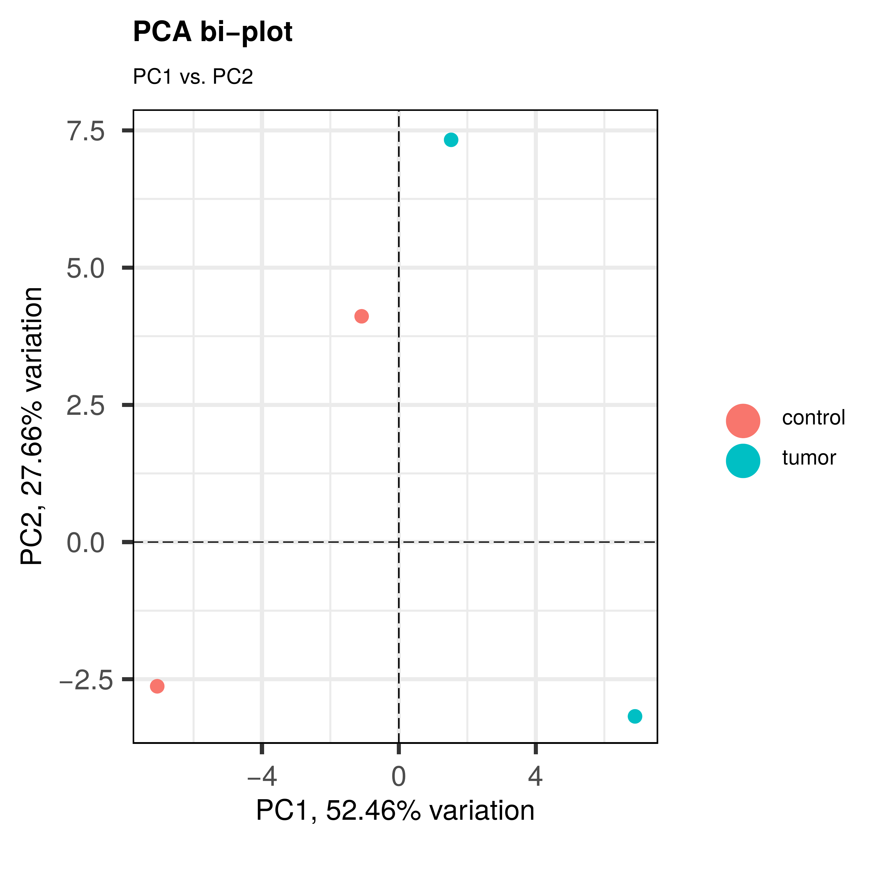
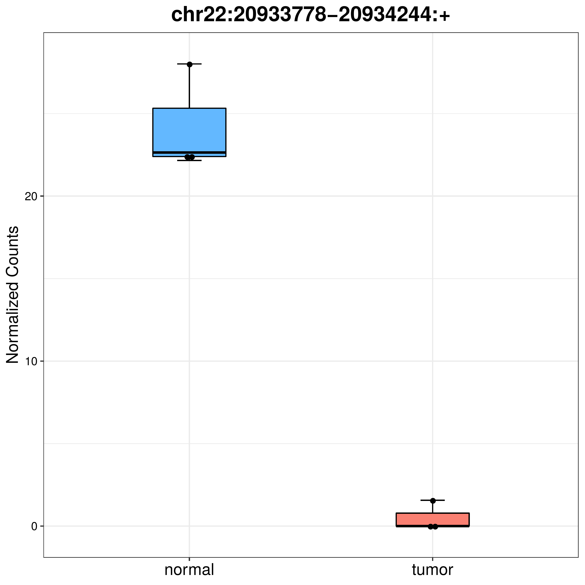
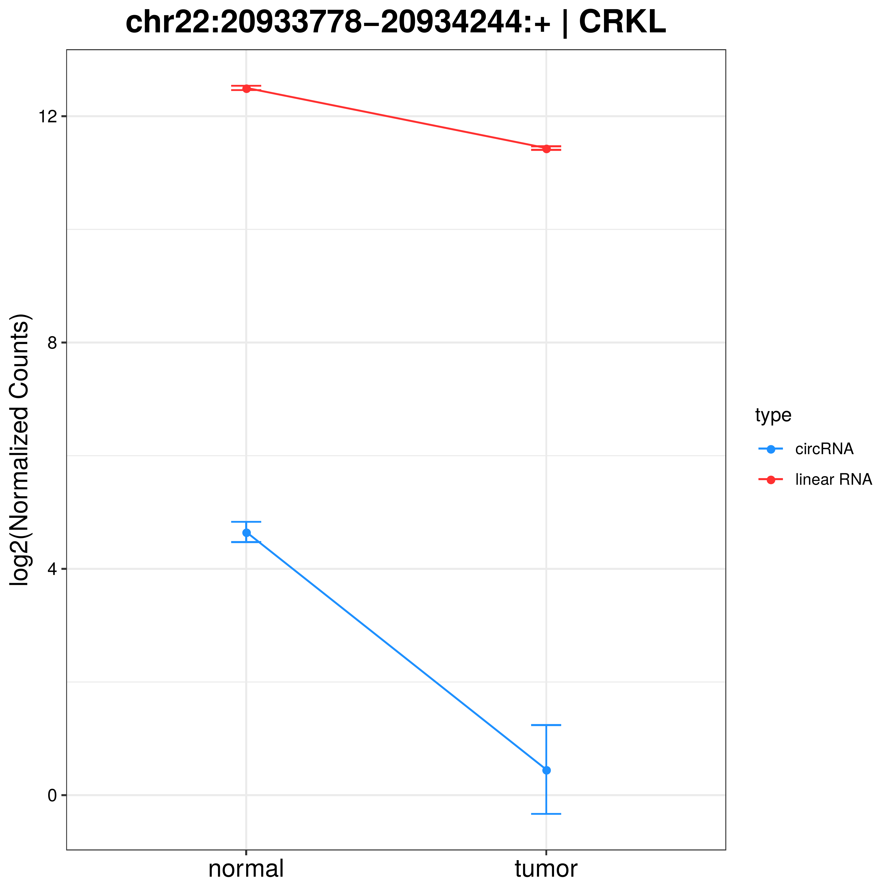

## Introduction
This documentation describes the output of `nf-core/circrna` for the test dataset which runs all 3 modules in the workflow: circRNA discovery, miRNA prediction and differential expression analysis of circular RNAs in RNA-Seq data.  

The processes listed below will fall into one of 4 output directories produced by `nf-core/circrna`:

```console
|-- results/
       |-- quality_control
       |-- circrna_discovery
       |-- mirna_prediction
       |-- differential_expression
```

## Pipeline Overview:

The pipeline is built using [Nextflow](https://www.nextflow.io/) and processes data using the following steps:

* [Download files](#download-files)
  * [Reference files](#reference-files) - Download reference files
  * [miRNA databases](#mirna-databases) - Download mature miRNA sequences
* [Quality Control](#quality-control)
  * [BAM to Fastq](#bam-to-fastq) - Convert BAM to fastq
  * [FastQC](#fastqc) - Raw read QC
  * [MultiQC](#multiqc) - Consolidated fastqc reports
  * [BBDUK](#bbduk) - Adapter trimming, quality and length filtering
* [Genome index files](#genome-index-files)
* [circRNA quantification](#circrna-quantification)
  * [Miscellaneous requirements](#miscellaneous-requirements) - Generate tool specific requirements
  * [CIRCexplorer2](#circexplorer2) - Annotation of circular RNAs from STAR 2 pass mode Chimeric out files
  * [circRNA finder](#circrna-finder) - Identify circular RNAs from STAR 2 pass mode SAM files
  * [CIRIquant](#ciriquant) - De novo identification of circular RNAs using circular pseudo reference
  * [DCC](#dcc) - Identify circular RNAs from STAR 2 pass mode utilising joint *and* separate read pairs
  * [find circ](#find-circ) - Identify circular RNAs in unmapped anchors from Bowtie2
  * [MapSplice](#mapsplice) - Identify circular RNAs in unmapped anchors from Bowtie
  * [STAR](#star) - Characterise back-splice junctions in all samples using 2 pass mode
* [circRNA annotation](#circrna-annotation)
  * [Annotated circRNAs](#annotated-circrnas) - Basic circRNA information
  * [BED12 files](#bed12-files) - Individual circRNA coordinates in BED12 format
  * [count matrix](#count-matrix) - circRNA counts matrix
  * [fasta](#fasta) - mature spliced circRNA fasta sequence
* [miRNA target prediction](#mirna-target-prediction)
  * [miranda](#miranda) - Raw output from miRanda
  * [targetscan](#targetscan) - Raw output from TargetScan
  * [miRNA targets](#mirna-targets) - Filtered outputs from miRanda, TargetScan for each circRNA
  * [circos plots](#circos-plots) - circos plot of circRNA - miRNA filtered predictions
* [Differential expression analysis](#differential-expression-analysis)
  * [circRNA](#circrna) - Output directory for circRNA DESeq2 analysis
  * [circRNA differential expression stats](#circrna-differential-expression-stats) - Differentially expressed circRNA statistics
  * [circRNA expression plots](#circrna-expression-plots) - Plots of circRNA, circRNA - parent gene expression
  * [RNA-Seq](#rna-seq) - Output directory for RNA-Seq DESeq2 analysis

## Download Files

### Reference Files

<details markdown="1">
<summary>Output files</summary>

* `circrna_discovery/reference/`
  * `*.fa`: Gencode reference FASTA file.
  * `*.gtf `: Gencode reference GTF file.
  * `*.txt`: Customised reference text annotation file.

</details>

`nf-core/circrna` has been designed exclusively with [gencode](https://www.gencodegenes.org/) reference files due to their ubiquitous compatibility with circRNA quantification tools. For this reason, ENSEMBL and UCSC reference files are not recommended. The user can specify which genome version to use `GRCh37/GRCh38` via the configuration file using the `--genome_version` parameter.


### miRNA Databases

<details markdown="1">
<summary>Output files</summary>

* `mirna_prediction/assets/`
  * `hsa_mature.fa`: mature *H. sapiens* miRNA sequences in FASTA format for `miRanda` compatibility.
  * `hsa_miR.txt`: mature *H. sapiens* miRNA sequences in tab delimited format with species ID information for `TargetScan` compatibility.  

</details>

Mature miRNA sequences are downloaded from [miRbase](http://www.mirbase.org/ftp.shtml) and [TargetScan](http://www.targetscan.org/cgi-bin/targetscan/data_download.vert72.cgi) as inputs for  `miRanda` and `targetscan.pl` miRNA prediction tools, respectively.

## Quality Control

### Bam to Fastq

<details markdown="1">
<summary>Output files</summary>

* `quality_control/preprocessing/bamtofastq/`
  * `*_R{1,2}.fq.gz`: Paired end fastq files, generated using `VALIDATION_STRINGENCY=LENIENT`.

</details>

`nf-core/circrna` can accept input BAM files generated from paired end sequencing reads (e.g `TCGA`) by invoking [picard](https://broadinstitute.github.io/picard/) `SamToFastq`, converting BAM files to paired end fastq files.

### FastQC

<details markdown="1">
<summary>Output files</summary>

* `quality_control/fastqc/`
  * `raw/`
    * `*{html,zip}`: Output files from `fastqc` for unprocessed RNA-Seq data.
  * `trimmed/`
    * `*{html,zip}`: Output files from `fastqc` for RNA-Seq reads processed by `BBDUK`.

</details>

[FastQC](http://www.bioinformatics.babraham.ac.uk/projects/fastqc/) gives general quality metrics about your reads. It provides information about the quality score distribution across your reads and the per base sequence content (%T/A/G/C). Information about adapter contamination and other over-represented sequences are also displayed.

### MultiQC

<details markdown="1">
<summary>Output files</summary>

* `quality_control/multiqc/`
  * `Raw_Reads_MultiQC.html`: Summary reports of unprocessed RNA-Seq reads.
  * `Trimmed_Reads_MultiQC.html`: Summary reports of processed RNA-Seq reads.

</details>

[MultiQC](http://multiqc.info) is a visualization tool that generates a single HTML report summarising all samples in your project. Most of the pipeline QC results are visualised in the report and further statistics are available in the report data directory.

### BBDUK

<details markdown="1">
<summary>Output files</summary>

* `quality_control/preprocessing/BBDUK/`
  * `*_r{1,2}.trim.fq.gz`: Processed paired end fastq files.

</details>

[BBDUK](https://jgi.doe.gov/data-and-tools/bbtools/bb-tools-user-guide/bbduk-guide/) (DUK - "Decontamination Using Kmers") is capable of performing adapter trimming, quality trimming + filtering and read length filtering for the quality control of sequencing reads. `nf-core/circrna` will automatically output gzipped fastq files from `BBDUK` to minimise data usage.


## Genome Index Files

<details markdown="1">
<summary>Output files</summary>

* `circrna_discovery/index/`
  * `bowtie/`: Directory containing `Bowtie` indices.
  * `bowtie2/`: Directory containing `Bowtie2` indices.
  * `bwa/`: Directory containing `BWA` indices.
  * `hisat2/`: Directory containing `HISAT2` indices.
  * `samtools`: Directory containing `SAMtools` index file.
  * `STAR`: Directory containing `STAR` indices.

</details>

`nf-core/circrna` will automatically generate genome index files depending on the circRNA quantification tools selected for the `circrna_discovery` module. In subsequent workflow runs, users should specify the paths to the genome index files generated to save compute resources - please check `nf-core/circrna` [parameter documentation](https://nf-co.re/circrna/dev/parameters#reference-genome-options) for guidance on how to do this.

*N.B:* Index files must be regenerated if the user re-runs the analysis using different genome version.

## circRNA Quantification

### Miscellaneous Requirements

<details markdown="1">
<summary>Output files</summary>

* `circrna_discovery/reference/chromosomes/`
  * `*.fa`: Individual FASTA files per chromosome.
* `circrna_discovery/ciriquant/`
  * `travis.yml`: Example of `.yml` file below which is automatically generated for the user.

  ```bash
  name: ciriquant
  tools:
   bwa:  /opt/conda/envs/nf-core-circrna-1.0dev/bin/bwa
   hisat2:  /opt/conda/envs/nf-core-circrna-1.0dev/bin/hisat2
   stringtie:  /opt/conda/envs/nf-core-circrna-1.0dev/bin/stringtie
   samtools: /opt/conda/envs/nf-core-circrna-1.0dev/bin/samtools
  reference:
   fasta: /data/bdigby/results/circrna_discovery/reference/GRCh37.fa
   gtf: /data/bdigby/results/circrna_discovery/reference/GRCh37.gtf
   bwa_index: /data/bdigby/results/circrna_discovery/index/bwa/GRCh37
   hisat_index: /data/bdigby/results/circrna_discovery/index/hisat2/GRCh37
  ```

</details>

`CIRIquant` requires a `.yaml` file specifying the containerised paths of `BWA`, `SAMtools`, `HISAT2`, `StringTie` executables in addition to the absolute paths for the reference FASTA, GTF files and `BWA`, `HISAT2` genome index files.

`MapSplice` requires the reference FASTA file to be split into individual FASTA files per chromosome.

### CIRCexplorer2

<details markdown="1">
<summary>Output files</summary>

* `circrna_discovery/tool_outputs/circexplorer2/${sample_id}/`
  * `*.STAR.junction.bed`: Intermediate file generated by `CIRCexplorer2 parse` module, identifying STAR fusion junctions for downstream annotation.
  * `*.txt`: Output files generated by `CIRCexplorer2 annotate` module, based on BED 12 format containing circRNA genomic location information, exon cassette composition and an additional 6 columns specifying circRNA annotations.  Full descriptions of the 18 columns can be found in the `CIRCexplorer2` [documentation](https://circexplorer2.readthedocs.io/en/latest/modules/annotate/#output).

* `circrna_discovery/filtered_outputs/circexplorer2/`
  * `*_circexplorer2.bed`: Parsed `CIRCexplorer2` outputs in minimal BED file format. Low confidence circRNAs (BSJ reads < 2) have been removed.

</details>

[CIRCexplorer2](https://circexplorer2.readthedocs.io/en/latest/) uses `*.Chimeric.out.junction` files generated from `STAR` 2 pass mode to extract back-splice junction sites using the `CIRCexplorer2 parse` module. Following this, `CIRCexplorer2 annotate` performs re-alignment of reads to the back-splice junction sites to determine the precise positions of downstream donor and upstream acceptor splice sites. Back-splice junction sites are subsequently updated and annotated using the customised annotation text file.

### circRNA finder

<details markdown="1">
<summary>Output files</summary>

* `circrna_discovery/tool_outputs/circrna_finder/${sample_id}/`
  * `*.Chimeric.out.sorted.{bam,bam.bai}`: (Sorted and indexed) bam file with all chimeric reads identified by STAR. The circRNA junction spanning reads are a subset of these.
  * `*.filteredJunctions.bed`: A bed file with **all** circular junctions found by the pipeline. The score column indicates the number reads spanning each junction.
  * `*.s_filteredJunctions.bed`: A bed file with those junctions in `*.filteredJunctions.bed` that are flanked by GT-AG splice sites. The score column indicates the number reads spanning each junction.
  * `*.s_filteredJunctions_fw.bed`:  A bed file with the same circular junctions as in file (b), but here the score column gives the average number of forward spliced reads at both splice sites around each circular junction.

* `circrna_discovery/filtered_outputs/circrna_finder/`
  * `*_circrna_finder.bed`: Parsed `circrna_finder` outputs in minimal BED file format. Low confidence circRNAs (BSJ reads < 2) have been removed.

</details>

[circRNA finder](https://github.com/orzechoj/circRNA_finder) uses `*.Chimeric.out.sam`, `*.Chimeric.out.junction` & `*.SJ.out.tab` files to identify circular RNAs in RNA-Seq data.

### CIRIquant

<details markdown="1">
<summary>Output files</summary>

* `circrna_discovery/tool_outputs/ciriquant/${sample_id}/`
  * `*.log`: A `CIRIerror.log` file which should be empty, and a `${sample_id}.log` file which contains the output log of `CIRIquant`.
  * `*.bed`: `CIRI2` output file in BED 6 format.
  * `*.gtf`: Output file from `CIRIquant` in GTF format. Full description of the columns available in the `CIRIquant` [documentation](https://ciriquant-cookbook.readthedocs.io/en/latest/quantification.html#output-format).
* `circrna_discovery/tool_outputs/ciriquant/${sample_id}/align/`
  * `*.sorted.{bam, bam.bai}`: (Sorted and indexed) bam file from `HISAT2` alignment of RNA-Seq reads.
* `circrna_discovery/tool_outputs/ciriquant/${sample_id}/circ/`
  * `*.ciri`: `CIRI2` output file.
  * `*_denovo.sorted.{bam, bam.bai}`: (Sorted and indexed) bam file from `BWA` alignment of candidate circular reads to the pseudo reference.
  * `*_index.*.ht2`: `BWA` index files of the pseudo reference.
  * `*_index.fa`: Reference FASTA file of candidate circular reads.
* `circrna_discovery/filtered_outputs/ciriquant/`
  * `*_ciriquant.bed`: Parsed `CIRIquant` outputs in minimal BED file format. Low confidence circRNAs (BSJ reads < 2) have been removed.

</details>

[CIRIquant](https://github.com/Kevinzjy/CIRIquant) operates by aligning RNA-Seq reads using `HISAT2` and [CIRI2](https://sourceforge.net/projects/ciri/files/CIRI2/) to identify putative circRNAs. Next, a pseudo reference index is generated using `bwa index ` by concatenating the two full-length sequences of the putative back-splice junction regions. Candidate circular reads are re-aligned against this pseudo reference using `bwa mem`, and back-splice junction reads are determined if they can be linearly and completely aligned to the putative back-splice junction regions.

### DCC

<details markdown="1">
<summary>Output files</summary>

* `/circrna_discovery/tool_outputs/dcc/${sample_id}/`
  * `*CircCoordinates`: Circular RNA annotations in BED format. Full description of the columns are available in the `DCC` [documentation](https://github.com/dieterich-lab/DCC#output-files-generated-by-dcc).
  * `*CircRNACount`: A table containing read counts for circRNAs detected.
  * `mate1/`: Output directory of STAR 2nd pass alignment for R1.
  * `mate2/`: Output directory of STAR 2nd pass alignment for R2.
* `circrna_discovery/filtered_outputs/dcc/`
  * `*_dcc.bed`: Parsed `DCC` outputs in minimal BED file format. Low confidence circRNAs (BSJ reads < 2) have been removed.

</details>

[DCC](https://github.com/dieterich-lab/DCC) identifies back-splice junction sites from `*Chimeric.out.junction`, `*SJ.out.tab` & `*Aligned.sortedByCoord.out.bam` files generated by `STAR` 2 pass mode, mapping the paired end reads both jointly and separately (`STAR` does not output read pairs that contain more than one chimeric junction thus a more granular approach is taken by `DCC` to fully characterise back-splice junctions in reads).

`DCC` then performs a series of filtering steps on candidate circular reads:

1. Mapping of mates must be consistent with a circular RNA template i.e align to the back-splice junction.
2. Filtering by a minimum number of junction reads per replicate (`nf-core/circrna` has set this parameter to`-Nr 1 1` allowing all reads).
3. Circular reads are not allowed span more than one gene.
4. Circular reads aligning to mitochondrial genome are removed.
5. Circular reads that lack a canonical (GT/AG) splicing signal at the circRNA junction borders are removed.

### find circ

<details markdown="1">
<summary>Output files</summary>

* `circrna_discovery/tool_outputs/find_circ/${sample_id}/`
  * `*_anchors.qfa.gz`: 20mer anchors extracted from unmapped reads.
  * `*_unmapped.bam`: Unmapped RNA-Seq reads to reference genome.
  * `*.sites.bed`: Output from `find_circ`, first six columns are in standard BED format. A description of the remaining columns is available in the `find_circ` [documentation](https://github.com/marvin-jens/find_circ#output-format).
  * `*.sites.log`: Summary statistics of candidate circular reads in the sample.
  * `*.sites.reads`: Tab delimited file containing circRNA ID & sequence.
* `circrna_discovery/filtered_outputs/find_circ/`
  * `*_find_circ.bed`: Parsed `find_circ` outputs in minimal BED file format. Low confidence circRNAs (BSJ reads < 2) have been removed.

</details>

[find circ](https://github.com/marvin-jens/find_circ) utilises `Bowtie2` short read mapper to align RNA-Seq reads to the genome. Reads that align fully and contiguously are discarded. Unmapped reads are converted to 20mers and aligned independently to find unique anchor positions within spliced exons - anchors that align in reverse orientation indicate circular RNA junctions. Anchor alignments are extended and must meet the following criteria:

1. Breakpoints flanked by GT/AG splice sites.
2. Unambiguous breakpoint detection.
3. Maximum 2 mismatches in extension procedure.
4. Breakpoint cannot reside more than 2nt inside a 20mer anchor.
5. 2 reads must support the junction.

### MapSplice

<details markdown="1">
<summary>Output files</summary>

* `circrna_discovery/tool_outputs/mapsplice/${sample_id}/`
  * `alignments.bam`: Bam file containing aligned reads and fusion alignments.
  * `deletions.txt`: Report of deletions.
  * `Fusion output files`:
    * `fusions_raw.txt`: raw fusion junctions without filtering
    * `fusion_candidates.txt`: filtered fusion junctions  
    * `fusions_well_annotated.txt`:  annotated fusion junction candidates (align to annotation file provided)
    * `fusions_not_well_annotated.txt`: fusions that do not align with supplied annotations
    * `circular_RNAs.txt`: circular RNAs reported.
  * `insertions.txt`: Report of Insertions.
  * `junctions.txt`: Reported splice junctions.
  * `stats.txt`: Read alignment, Junction statistics.

</details>

[MapSplice](http://www.netlab.uky.edu/p/bioinfo/MapSplice2) first splits reads into segments, and maps them to reference genome by using `Bowtie`. `MapSplice` attempts to fix unmapped segments as gapped alignments, with each gap corresponding to a splice junction. Finally a remapping step is used to identify back-spliced alignments that are in the presence of small exons.

### STAR

<details markdown="1">
<summary>Output files</summary>

* `circrna_discovery/tool_outputs/STAR/1st_Pass/${sample_id}/`
  * `*.Aligned.sortedByCoord.out.bam`: Coordinate sorted bam file containing aligned reads and chimeric reads.
  * `*.Chimeric.out.junction`: Each line contains the details of chimerically aligned reads. Full descriptions of columns can be found in `STAR` [documentation](https://physiology.med.cornell.edu/faculty/skrabanek/lab/angsd/lecture_notes/STARmanual.pdf) (section 5.4).
  * `*.Chimeric.out.sam`: Chimeric alignments in SAM format.
  * `*.Log.final.out`:  Summary mapping statistics after mapping job is complete, useful for quality control. The statistics are calculated for each read (single- or paired-end) and then summed or averaged over all reads.
  * `*.Log.out`: Main log file with a lot of detailed information about the run. This file is most useful for troubleshooting and debugging.
  * `*.Log.progress.out`: Reports job progress statistics, such as the number of processed reads, % of mapped reads etc.
  * `*.SJ.out.tab`: High confidence collapsed splice junctions in tab-delimited form. Full description of columns can be found in  `STAR` [documentation](https://physiology.med.cornell.edu/faculty/skrabanek/lab/angsd/lecture_notes/STARmanual.pdf) (section 4.4).

* `circrna_discovery/tool_outputs/STAR/2nd_Pass/${sample_id}/`
  * `*.Aligned.sortedByCoord.out.bam`: Coordinate sorted bam file containing aligned reads and chimeric reads.
  * `*.Chimeric.out.junction`: Each line contains the details of chimerically aligned reads. Full descriptions of columns can be found in `STAR` [documentation](https://physiology.med.cornell.edu/faculty/skrabanek/lab/angsd/lecture_notes/STARmanual.pdf) (section 5.4).
  * `*.Chimeric.out.sam`: Chimeric alignments in SAM format.
  * `*.Log.final.out`:  Summary mapping statistics after mapping job is complete, useful for quality control. The statistics are calculated for each read (single- or paired-end) and then summed or averaged over all reads.
  * `*.Log.out`: Main log file with a lot of detailed information about the run. This file is most useful for troubleshooting and debugging.
  * `*.Log.progress.out`: Reports job progress statistics, such as the number of processed reads, % of mapped reads etc.
  * `*.SJ.out.tab`: High confidence collapsed splice junctions in tab-delimited form. Full description of columns can be found in  `STAR` [documentation](https://physiology.med.cornell.edu/faculty/skrabanek/lab/angsd/lecture_notes/STARmanual.pdf) (section 4.4).
* `circrna_discovery/tool_outputs/STAR/SJFile/`
  * `*.SJFile.tab`: Chromosome, start, end & strand coordinates of novel splice junctions.

</details>

[STAR](https://github.com/alexdobin/STAR) can characterise novel splice junctions in RNA-Seq data by specifying `--ChimOutType Junctions`, with reported novel junctions written to a `*SJ.out.tab` file (per sample). Following the initial `STAR` alignment, a 2nd pass strategy is employed whereby **all** `*SJ.out.tab` files from RNA-Seq samples are converted to `*SJFile.tab` files of novel junction coordinates and provided during the 2nd alignment step via `--sjdbFileChrStartEnd`.

This achieves the highest sensitivity for novel junction alignment. For instance, if there is a novel junction that's highly expressed (many reads, confident detection) in the wild-type, but only weakly expressed (few reads) in the experimental group, by using junctions detected in all samples for the 2nd pass, `STAR` will detect lowly expressed spliced reads in the experimental group.

## circRNA Annotation

### Annotated circRNAs

<details markdown="1">
<summary>Output files</summary>

* `circrna_discovery/annotated/`
  * `circrnas_annotated.txt`: Master file containing circRNA_ID, Type, Mature_Length, Parent_Gene & Strand for all circRNAs.

</details>

`nf-core/circrna` utilises filtered BED outputs from circRNA quantification tools and performs circRNA annotation using a filtered GTF file (biotypes not involved in circRNA biogenesis are removed). circRNA mature spliced length, parent gene and circRNA type are calculated using a customised script.

### BED12 Files

<details markdown="1">
<summary>Output files</summary>

* `circrna_discovery/bed12/`
  * `*_bed12.bed`: Columns described in `BEDtools` [documentation](https://bedtools.readthedocs.io/en/latest/content/general-usage.html#bed-format). Note that the itemRGB column has been replaced with circRNA type.

</details>

`nf-core/circrna` outputs each filtered circRNA in BED12 format. Initially an intermediate file used for calculating the mature spliced sequence of circRNAs, the user may wish to concatenate the individual BED12 files into a master file for visualisation in IGV.

### Count Matrix

<details markdown="1">
<summary>Output files</summary>

* `circrna_discovery/count_matrix/`
  * `circRNA_matrix.txt`: Raw circRNA read counts for all samples in matrix format.

</details>

`nf-core/circrna` produces a counts matrix of circRNA read counts for each sample. circRNAs with BSJ reads < 2 have been removed during the quantification step, with a further filtering step included depending on the number of quantification tools selected. If the user has selected more than one circRNA quantification tool, `nf-core/circrna` will demand that a circRNA be called by at least two quantification tools or else it is removed. This approach is recommended to reduce the number of false positives.

### Fasta

<details markdown="1">
<summary>Output files</summary>

* `circrna_discovery/fasta/`
  * `*.fa`: Mature spliced sequence of circRNAs.  

</details>

`nf-core/circrna` produces the mature spliced sequence of circRNAs in fasta format. Note that `nf-core/circrna` assumes for `circRNA type: circRNA` that all introns are removed from the mature sequence. For `circRNA type: EIciRNA` if the start/end of the circRNA falls outside 200nt of an annotated exon, the entire circRNA sequence (both exonic and intronic) is assumed to be in the mature splice length. If the `EIciRNA` falls within 200nt of an annotated exon, `nf-core/circrna` attempts to re-fit the circRNA as `circRNA type: circRNA` and all introns are removed from the sequence.

## miRNA Prediction

### miRanda

<details markdown="1">
<summary>Output files</summary>

* `mirna_prediction/miranda/`
  * `*.miRanda.txt`: Raw outputs from `miRanda`.

</details>

[miRanda](http://cbio.mskcc.org/miRNA2003/miranda.html) performs miRNA target prediction of a genomic sequence against a miRNA database in 2 phases:

1. First a dynamic programming local alignment is carried out between the query miRNA sequence and the reference  sequence. This alignment procedure scores based on sequence complementarity and not on sequence identity.
2. Secondly, the algorithm takes high-scoring alignments detected from phase 1 and estimates the thermodynamic stability of RNA duplexes based on these alignments. This second phase of the method utilises folding routines from the `RNAlib` library,  part of the [ViennaRNA](https://www.tbi.univie.ac.at/RNA/) package.

### TargetScan

<details markdown="1">
<summary>Output files</summary>

* `mirna_prediction/targetscan/`
  * `*.targetscan.txt`: Raw outputs from `TargetScan`.

</details>

[TargetScan](http://www.targetscan.org/vert_72/) predicts biological targets of miRNAs by searching for the presence of conserved 8mer, 7mer, and 6mer sites within the circRNA mature sequence that match the seed region of each miRNA.

### miRNA targets

<details markdown="1">
<summary>Output files</summary>

* `mirna_prediction/mirna_targets/`
  * `*_miRNA_targets.txt`: Filtered target miRNAs of circRNAs called by quantification tools. Columns are self explanatory: miRNA, Score, Energy_KcalMol, Start, End, Site_type.

</details>

`nf-core/circrna` performs miRNA target filtering on `miRanda` and `TargetScan` predictions:

1. miRNA must be called by both `miRanda` and `TargetScan`.
2. `6mer` site predictions are removed from `TargetScan` output. `nf-core/circrna` requires:
   * `7mer-m8`: An exact match to positions 2-8 of the mature miRNA (the seed + position 8).
   * `7mer-A1`: An exact match to positions 2-7 of the mature miRNA (the seed) followed by an 'A'.
   * `8-mer`: An exact match to positions 2-8 of the mature miRNA (the seed + position 8) followed by an 'A'.
3. Removal of miRNAs with minimum free energy of <= -20.00 Kcal/Mol as calculated by `ViennaRNA`.
4. If a site within the circRNA mature sequence shares duplicate miRNA ID's overlapping the same coordinates, the miRNA with the highest score is kept.

### Circos Plot

<details markdown="1">
<summary>Output files</summary>

* `mirna_prediction/circos_plots/`
  * `*_miRNA_Plot.pdf`: Circos plot of mature spliced circRNA sequence with exon boundaries where applicable, displaying miRNA binding sites.

</details>

`nf-core/circrna` plots the filtered miRNA targets given using a circos plot, displaying the miRNA response elements along the mature circRNA sequence. Please note this plot becomes overcrowded when plotting `EIciRNAs` due to their highly variable sequence length (in contrast to `circRNAs` and `ciRNAs` which typically fall within the range of 100 - 1000nt). Therefore `EIciRNAs` with large mature spliced lengths should be considered as potentially spurious calls.

<p markdown="1" align="center">

</p>

## Differential Expression Analysis

`nf-core/circrna` will perform differential expression analysis of `control` vs. all factors in the response variable:

| samples | condition | replicates |
|---------|-----------|------------|
| ctrl_1  | control   | 1          |
| ctrl_2  | control   | 2          |
| ctrl_3  | control   | 3          |
| A549_1  | lung      | 1          |
| A549_2  | lung      | 2          |
| A549_3  | lung      | 3          |
| A375_1  | melanoma  | 1          |
| A375_2  | melanoma  | 2          |
| A375_3  | melanoma  | 3          |

The above experimental design will produce the `DESeq2` design formula `~replicates + condition` and loop through the nested factors within `condition` producing outputs for `control_vs_lung` and `control_vs_melanoma` whereby upregulated circRNAs correspond to upregulated circRNAs in the experimental condition with respect to `control`.

*N.B:* In the phenotype file the response variable must be called `condition`, and the wild-type samples must be called `control`. These values are hard-coded in the automated differential expression analysis R script.

### circRNA

<details markdown="1">
<summary>Output files</summary>

* `differential_expression/circRNA/`
  * `DESeq2_condition_PCA.pdf`: Principal component plot (PC1 vs PC2) displaying the highest amount of variation present in the dataset using [PCAtools](https://bioconductor.org/packages/release/bioc/html/PCAtools.html).
  <p markdown="1" align="center">
  
  </p>

  * `DESeq2_dispersion.pdf`: Plot of re-fitted genes + gene outliers after shrinkage estimation performed by gene-wide maximum likelihood estimates (red curve) & maximum a posteriori estimates of dispersion.
  * `DESeq2_log2_transformed_counts.txt`: *log2(Normalised counts + 1)*
  * `DESeq2_MAplot.pdf`: `DESeq2` MA plot.
  * `DESeq2_normalized_counts.txt`: Normalised circRNA counts.
  * `DESeq2_{condition_vs_control}_Adj_pvalue_distribution.pdf`: Histogram of Adj pvalues from `results(dds)` displaying the distribution of circRNAs that reject the null hypothesis (padj <= 0.05).
  * `DESeq2_{condition_vs_control}_down_regulated_differential_expression.txt`: DESeq2 `results()` output filtered to include only down regulated circRNAs (fold change <= -1, pvalue <= 0.05).
  * `DESeq2_{condition_vs_control}_fold_change_distribution.pdf`: Histogram of fold-change values for differentially expressed circRNAs.
  * `DESeq2_{condition_vs_control}_global_heatmap.pdf`: Heatmap of all differentially expressed circRNAs.
  * `DESeq2_{condition_vs_control}_pvalue_distribution.pdf`: Histogram of pvalues from `results(dds)` displaying the distribution of circRNAs that reject the null hypothesis (pvalue <= 0.05).
  * `DESeq2_{condition_vs_control}_up_regulated_differential_expression.txt`: DEseq2 `results()` ouput filtered to include only up regulated circRNAs (fold change >= 1, pvalue <= 0.05).
  * `DESeq2_{condition_vs_control}_volcano_plot.pdf`: Volcano plot of differentially expressed circRNAs from DESeq2 `results()` using [EnhancedVolcano](https://www.bioconductor.org/packages/release/bioc/vignettes/EnhancedVolcano/inst/doc/EnhancedVolcano.html).
  * `DESeq2_sample_dendogram.pdf`: Dendogram depicting sample distances using [pvclust](https://cran.r-project.org/web/packages/pvclust/index.html).
  * `DESeq2_sample_heatmap.pdf`: Manhattan distance heatmap of samples.
  * `DESeq2_Scree_plot.pdf`: Elbow plot of principal components in the dataset using [PCAtools](https://bioconductor.org/packages/release/bioc/html/PCAtools.html).

</details>

Output directory of DESeq2 circRNA differential expression analysis, quality control, results plots and contrast outputs.

### circRNA Differential Expression Stats

<details markdown="1">
<summary>Output files</summary>

* `differential_expression/circrna_diff_exp_stats/`
  * `DE_circRNAs.txt`: Both up and down regulated circRNAs in a master file.
  * `Down_Regulated_circRNAs.txt`: Annotated down regulated circRNAs.
  * `Up_Regulated_circRNAs.txt`: Annotated up regulated circRNAs.

</details>

`nf-core/circrna` combines the output of `DESeq2` and annotated circRNAs to provide a comprehensive annotation of differentially expressed circRNAs. Headers in files are: circRNA_ID, Type, Mature_Length, Parent_Gene, Strand, Log2FC, pvalue, Adjusted_pvalue, Description

*Description* refers to the entrez gene description of the parent gene.

### circRNA Expression Plots

<details markdown="1">
<summary>Output files</summary>

* `differential_expression/circrna_expression_plots/`
  * `*boxplot.pdf`: Boxplot of circRNA expression between phenotypes of interest.
  * `*expression.pdf`: *log2* transformed line plot of both circRNA and parent gene expression in phenotypes of interest.  

</details>

`nf-core/circrna` will produce a boxplot of circRNA expression and a lineplot of circRNA - parent gene expression between the phenotypes specified in the `DESeq2` analysis.

*Note:* if the parent gene cannot be found in the normalised RNA-Seq count matrix, the line plot of circRNA - parent gene expression will be omitted. This behaviour is observed in the test dataset, which has been heavily modified to maximise circRNA reads and not reads aligning to transcripts for gene expression analysis.

<p markdown="1" align="center">

</p>

<p markdown="1" align="center">

</p>

### RNA-Seq

<details markdown="1">
<summary>Output files</summary>

* `DESeq2_condition_PCA.pdf`: Principal component plot (PC1 vs PC2) displaying the highest amount of variation present in the dataset using [PCAtools](https://bioconductor.org/packages/release/bioc/html/PCAtools.html).
* `DESeq2_dispersion.pdf`: Plot of re-fitted genes + gene outliers after shrinkage estimation performed by gene-wide maximum likelihood estimates (red curve) & maximum a posteriori estimates of dispersion.
* `DESeq2_log2_transformed_counts.txt`: *log2(Normalised counts + 1)*
* `DESeq2_MAplot.pdf`: `DESeq2` MA plot.
* `DESeq2_normalized_counts.txt`: Normalised gene counts.
* `DESeq2_{condition_vs_control}_Adj_pvalue_distribution.pdf`: Histogram of Adj pvalues from `results(dds)` displaying the distribution of genes that reject the null hypothesis (padj <= 0.05).
* `DESeq2_{condition_vs_control}_down_regulated_differential_expression.txt`: DESeq2 `results()` output filtered to include only down regulated genes (fold change <= -1, pvalue <= 0.05).
* `DESeq2_{condition_vs_control}_fold_change_distribution.pdf`: Histogram of fold-change values for differentially expressed genes.
* `DESeq2_{condition_vs_control}_global_heatmap.pdf`: Heatmap of all differentially expressed genes.
* `DESeq2_{condition_vs_control}_pvalue_distribution.pdf`: Histogram of pvalues from `results(dds)` displaying the distribution of genes that reject the null hypothesis (pvalue <= 0.05).
* `DESeq2_{condition_vs_control}_up_regulated_differential_expression.txt`: DEseq2 `results()` ouput filtered to include only up regulated genes (fold change >= 1, pvalue <= 0.05).
* `DESeq2_{condition_vs_control}_volcano_plot.pdf`: Volcano plot of differentially expressed genes from DESeq2 `results()` using [EnhancedVolcano](https://www.bioconductor.org/packages/release/bioc/vignettes/EnhancedVolcano/inst/doc/EnhancedVolcano.html).
* `DESeq2_sample_dendogram.pdf`: Dendogram depicting sample distances using [pvclust](https://cran.r-project.org/web/packages/pvclust/index.html).
* `DESeq2_sample_heatmap.pdf`: Manhattan distance heatmap of samples.
* `DESeq2_Scree_plot.pdf`: Elbow plot of principal components in the dataset using [PCAtools](https://bioconductor.org/packages/release/bioc/html/PCAtools.html).

</details>

Output directory of `DESeq2` gene differential expression analysis, complete with quality control, results plots and contrast outputs.
